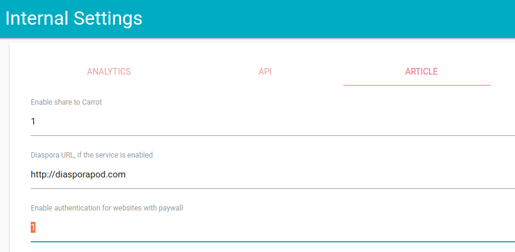

# Articles à accès restreint

wallabag offre un système pour récupérer les articles derrière un *paywall*, en fournissant vos identifiants lorsqu'un article est récupéré.

En version 2.2, seul l'administrateur pouvait mettre ses identifiants dans un fichier de configuration, rendant la fonctionnalité accessible à tous les utilisateurs de l'instance. Avec la version 2.3, tous les utilisateurs ont une section pour entrer leurs propres identifiants pour chaque site.

## Liste des sites compatibles

### Français

| Nom | Disponible à partir de la version |
| ------|-------- |
| Arrêt sur Images | 2.2 |
| Courrier International | 2.3 |
| Le Figaro | 2.3 |
| Le Monde | 2.3 |
| Le Monde Diplomatique | 2.3 |
| Mediapart | 2.2 |
| Next INpact | 2.2 |

## Activer l'authentification pour les paywall

Dans les paramètres internes, en tant qu'administrateur de wallabag, dans la section **Article**, activez l'authentification pour les articles
derrière un paywall (avec la valeur `1`).

## Gérez vos accès aux sites

Une fois activée, vous verrez une nouvelle entrée dans le menu de gauche: **Accès aux sites**.

Cliquez sur le lien pour aller à la gestion de vos accès aux sites. Vous pourrez ajouter autant de login / mot de passe que vous le souhaitez.

> **[info] Information**
>
> Ces informations sont accessible uniquement par **VOUS** et aucun autre utilisateur de l'instance wallabag.

## Sécurité

Les logins et mots de passe que vous allez définir seront encodés dans la base de donnée. Cela veut dire que l'administrateur de la base de donnée (et/ou l'administrateur de l'instance wallabag) ne pourront pas lire ces informations.

Si vous souhaitez plus de détail technique, vous pouvez lire [ces informations (en anglais)](https://github.com/defuse/php-encryption/blob/master/docs/Tutorial.md#scenario-1-keep-data-secret-from-the-database-administrator).

## Disponiblité du paywall d'un site

Si un site accessible par un paywall n'est pas disponible, vous pouvez le configurer.

Allez dans la [partie développeur](../../developer/paywall.md) pour en savoir plus.
